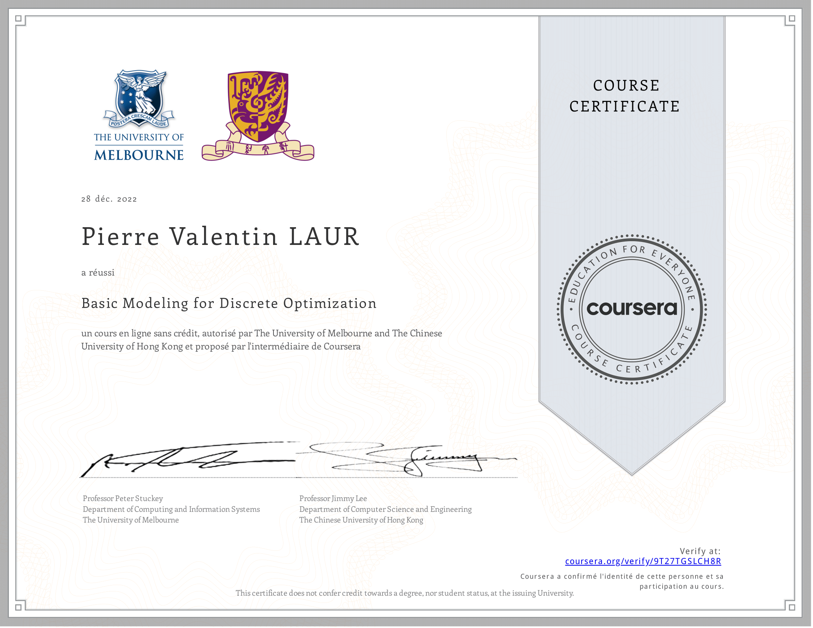

# Basic Modeling for Discrete Optimization

My work on the course [Basic Modeling for Discrete Optimization](https://www.coursera.org/learn/basic-modeling/). An introduction to Constraint Programming & Mixed Integer Linear Programming in the MiniZinc language, taught by Peter Stuckey & Jimmy Lee.

[Verify](https://coursera.org/verify/9T27TGSLCH8R)

